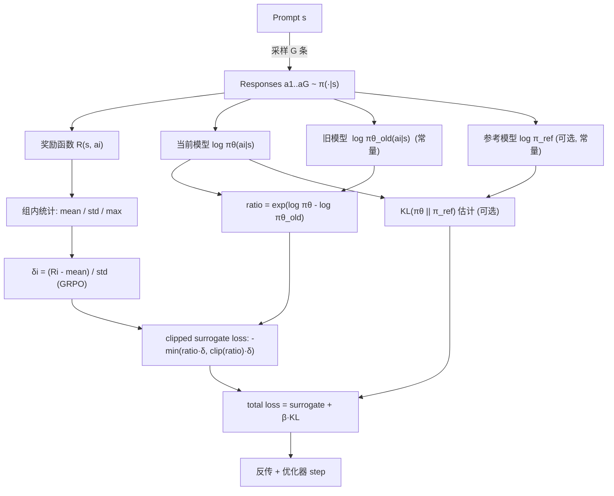

# CS336 Lecture 17｜RL2：策略梯度（Policy Gradient）的机制深挖

> 本笔记对应 `lecture_17.py`（逐段对应课堂讲解顺序）与课堂视频字幕。
> 目标：读者对照 Python 讲义 + 本笔记，即可在无视频的情况下完全掌握本节内容。
> 前置要求：会基本的 PyTorch 与概率/微积分；对"语言模型"和"监督微调 SFT"有粗略印象即可，不需要 RL 背景。

---

## 0. 这节课要回答什么

上一节课（Tatsu 主讲）给了"可验证奖励下的强化学习（RL from verifiable rewards）"的总览，介绍了 PPO、GRPO 等策略梯度算法。**本节课不引入新算法**，而是沿着同一条主线把策略梯度（特别是 GRPO）拆开，一步步看清楚：

1. 语言模型里的 RL 是怎么形式化的？
2. 为什么 naive policy gradient 不够用？（方差、稀疏奖励）
3. baseline 从哪里来？为什么它等价于 advantage？
4. GRPO 的完整算法长什么样？（对应 `lecture_17.py` 的 `run_policy_gradient`）
5. 训练时那些工程细节（`no_grad` 冻结、clipping、KL 惩罚）到底在做什么？

全文的代码主线在 `lecture_17.py` 的 `main()` 里，按三个阶段推进：
`rl_setup_for_language_models()` → `policy_gradient()` → `training_walkthrough()`。

---

## 1. 语言模型里的强化学习设定

对应 `lecture_17.py` 的 `rl_setup_for_language_models()`。

RL 的标准五元组是 **(S, A, T, R, π)**。把语言模型塞进来，每一项的含义都变得非常"简单"，但直觉和机器人 RL 很不一样。

| 元素 | 语言模型里的含义 |
| :-- | :-- |
| 状态 s | prompt + 已经生成的 response 片段（就是一段 token 序列） |
| 动作 a | 下一个要生成的 token |
| 奖励 R | 对一整条 response 打一个分 |
| 转移 T(s'\|s,a) | **确定性**的字符串拼接：s' = s + a |
| 策略 π(a\|s) | 一个（通常是已经预训练好的）语言模型 |

### 1.1 本节只考虑"outcome + verifiable"奖励

- **Outcome reward（结果奖励）**：只看整条回答的最终结果，中间过程不打分。
- **Verifiable reward（可验证奖励）**：奖励可以由一个确定的程序计算，不需要人打分。典型例子：数学题，模型生成推理链后写 "therefore, the answer is 3 miles"，我们用正则把 "3 miles" 抠出来，和标准答案比对，对就给 1，错就给 0。

正因为只看最终结果，"折扣（discounting）"和"bootstrap"这些传统 RL 概念在这里几乎用不上。代价是：**奖励稀疏 + 延迟**（sparse & delayed reward）——这会在第 2 节制造大麻烦。

### 1.2 与机器人 RL 最关键的三点差异

1. **转移是确定的**：你完全知道加一个 token 之后状态变成什么，所以可以做"规划 / test-time compute"（例如 MCTS、beam search、self-consistency）。这是机器人 RL 做梦都想要的。
2. **状态是"凭空造出来的"**：机器人的状态是物理的关节角和位姿，被物理世界死死约束。语言模型的状态就是一串 token，**想写什么写什么**，相当于无限自由的"草稿纸"。
3. **难点不一样**：机器人 RL 难在"状态根本到不了"；语言模型 RL 难在"token 随便写，但要让它指向正确答案"。

### 1.3 术语速查

- **Rollout / episode / trajectory**：一次完整生成过程 `s → a → a → ... → a → R`。
- **目标函数**：最大化期望奖励 E[R]，期望同时对 prompt s 和策略采样的 response a 取。

---

## 2. 策略梯度（Policy Gradient）

对应 `policy_gradient()`。

为了简化记号，用 **a 表示整条 response**（而不是单个 token）。在 outcome reward 下这样做完全等价——反正只有最后给一个分，中间怎么切 token 不影响。

### 2.1 推导：从 ∇E[R] 到 ∇log π · R

我们要最大化：

$$
\mathbb{E}[R] = \int p(s)\, \pi(a|s)\, R(s,a)\, ds\, da
$$

直接求梯度（只有 π 含参数）：

$$
\nabla \mathbb{E}[R] = \int p(s)\, \nabla \pi(a|s)\, R(s,a)\, ds\, da
$$

这一步本身没法直接采样估计，因为 ∇π(a|s) 不是一个概率分布，没法"采一个样就当作期望"。**log 技巧（log-derivative trick）** 把它救回来：

$$
\nabla \pi(a|s) = \pi(a|s)\, \nabla \log \pi(a|s)
$$

代回得：

$$
\nabla \mathbb{E}[R] = \int p(s)\, \pi(a|s)\, \nabla \log \pi(a|s)\, R(s,a)\, ds\, da = \mathbb{E}\!\left[\nabla \log \pi(a|s)\, R(s,a)\right]
$$

这就是**策略梯度定理**的本体。形式上和 SFT 的交叉熵梯度一模一样，只是多了一个权重 `R(s,a)`。

### 2.2 Naive Policy Gradient：就是"加权的 SFT"

算法就三步：

1. 从数据里采 prompt `s`；
2. 从当前策略采 response `a ~ π(·|s)`；
3. 用 `∇ log π(a|s) · R(s,a)` 做一次梯度上升。

**与 SFT 的关系**：如果 R ∈ {0,1}，那 naive policy gradient 等价于"**对模型自己生成的、恰好正确的样本做 SFT**"。唯一区别是：数据集随策略一起变化——每次参数更新后，下一轮采样的分布就变了。

> 课堂问答：为什么数据集会变？
> 因为每一轮更新后策略 π 变了，再采样 response 的分布就跟着变。理想情况下，随着训练推进，数据集里"正确回答"的比例越来越高，形成正反馈。

### 2.3 难点：高方差 + 稀疏奖励

普通 SGD 的方差问题已经够头疼，RL 方差是"另一个级别"：

- R 只有 {0, 1}，绝大多数 rollout 返回 0；
- 梯度 `∇ log π · R` 里，R=0 的项贡献完全是 0，相当于"这些样本根本没学到东西"；
- 如果策略刚起步、一道题都做不对，**连一次有效梯度都得不到，模型就卡死了**。

与之对照，**RLHF 里用"学出来的 reward model"给偏好打连续分**，几乎每条 response 都有非零信号，方差小得多。所以同样是 policy gradient，RLHF 和 verifiable RL 的调参习惯、算法选择都会不一样。

> 课堂问答：奖励为 0 不更新，能不能把 0 改成 -1，让它往反方向推？
> 可以，但更原则性的做法是下一节的 **baseline**——它会自动实现这件事。

### 2.4 Baseline：降方差的关键

**核心想法**：从奖励里减掉一个**只依赖状态 s、不依赖动作 a** 的函数 b(s)。

$$
\mathbb{E}[R - b(s)] = \mathbb{E}[R] - \mathbb{E}[b(s)]
$$

由于 b(s) 不依赖 π（或者我们把它当常数对待），减去它**不改变最优策略**，但可以大幅降低采样梯度的方差。

**为什么减 b(s) 不改变梯度（无偏性证明）**：

$$
\mathbb{E}_{a \sim \pi}\!\left[\nabla \log \pi(a|s)\, b(s)\right] = b(s) \sum_a \pi(a|s)\, \nabla \log \pi(a|s) = b(s)\, \nabla \sum_a \pi(a|s) = b(s) \cdot \nabla 1 = 0
$$

所以 `∇ log π · (R - b(s))` 与 `∇ log π · R` **期望相同**，但方差可以小得多。

#### 2.4.1 两状态玩具例子（讲义 `naive_variance` / `baseline_variance`）

设两个 prompt：

- s1：a1 奖励 11，a2 奖励 9
- s2：a1 奖励 0，a2 奖励 2

理想策略显然是 s1→a1、s2→a2。但 naive policy gradient 会怎么想？它看到 s1→a2 的奖励 9 **比 s2→a2 的奖励 2 大得多**，所以拼命把概率推向 s1→a2，反而在 s1 上学坏了。

讲义里算了一下标准差：

```python
naive_variance = torch.std(torch.tensor([11., 9, 0, 2]))    # ≈ 5.3
baseline_variance = torch.std(torch.tensor([11.-10, 9-10, 0-1, 2-1]))  # ≈ 1.1
```

给 s1 设 baseline 10、s2 设 baseline 1 后，梯度尺度从 5.3 降到 1.1，**同时 s1→a2 变成了 -1（负号），会被推走**。

#### 2.4.2 最优 baseline 与实用近似

对单参数模型，有闭式最优解：

$$
b^*(s) = \frac{\mathbb{E}\!\left[(\nabla \log \pi(a|s))^2\, R \mid s\right]}{\mathbb{E}\!\left[(\nabla \log \pi(a|s))^2 \mid s\right]}
$$

高维下是协方差形式，计算麻烦。**实用的启发式**：

$$
b(s) = \mathbb{E}[R \mid s]
$$

即"同一个 prompt 下的平均奖励"。这个量本身也得估计——**这就是 GRPO 的立足点**（见第 4 节）。

### 2.5 Baseline 与 Advantage 的关系

定义：

- **状态价值** V(s) = E[R | s]
- **动作价值** Q(s, a) = E[R | s, a]
- **优势函数** A(s, a) = Q(s, a) - V(s)

在我们的设定里（outcome reward + a 代表整条 response），Q 和 R 是同一个东西。于是：

$$
R(s,a) - b(s) \;\xrightarrow{\; b(s) = V(s) \;}\; Q(s,a) - V(s) = A(s,a)
$$

**结论**：用"同 prompt 平均奖励"做 baseline，等价于用 advantage 做加权。Advantage 的直觉是"这个动作比平均水平好多少"——好就往上推，差就往下拉。

### 2.6 统一记号 δ

无论用哪种 baseline 变体，都可以写成：

$$
\nabla \mathbb{E}[R] \approx \nabla \log \pi(a|s)\, \delta
$$

δ 的不同选择就是 PPO / GRPO / Dr.GRPO 等算法的主要区分点。后面第 4 节会看到 `compute_deltas` 支持四种 δ：`rewards` / `centered_rewards` / `normalized_rewards` / `max_rewards`。

> 本节所有推导与经典文献：CS224R lecture notes（讲义里也给了链接）。

---

## 3. GRPO：为语言模型量身定制的 PPO 简化版

对应 `training_walkthrough()` 的开头。

### 3.1 GRPO 的一句话定位

> GRPO = PPO 去掉 critic（价值函数），**用"同一个 prompt 下采多条 response 的组内平均奖励"当 baseline**。

**为什么 PPO 里要有 critic？** 因为 baseline b(s) = E[R|s] 不好估——在机器人 RL 里你一个 state 只会到一次，没法"同一个 state 多采几次平均"，只能另外训一个神经网络（critic / value network）来拟合 V(s)。

**为什么语言模型里可以不要 critic？** 因为 LM 推理本来就支持"同一个 prompt 多次采样"——一个 prompt 给我生成 10 条 response，把它们的奖励一平均，就是一个天然的 b(s) 估计。这是 LM 设定独有的结构红利。这也是为什么 **GRPO 是 2024 年才出现**，而 PPO 2017 年就有了——不是算法进步有多慢，是 LM 场景 2024 年才真正火起来。

整个算法的伪代码在讲义的 `images/grpo-algorithm.png`，我们下面把它在 Python 里实现一遍。

### 3.2 代码结构全景

`lecture_17.py` 的展开顺序：

1. `simple_task()`：定义排序任务 + 两个奖励函数；
2. `simple_model()`：搭一个玩具模型，跑完"采样→算奖励→算 δ→算 log prob→算 loss"的完整单步；
3. `run_policy_gradient()`：把上面那一套放进双层循环（外层 epoch，内层 update step）；
4. `experiments()`：用三种 δ（raw / centered / normalized）跑 100 个 epoch 对比。

---

## 4. 任务与奖励设计（`simple_task`）

为了能在笔记本上跑，作者选了一个极简任务：**排序 n 个数**。

- Prompt：n 个数，比如 `[1, 0, 2]`
- Response：n 个数，希望是排好序的 `[0, 1, 2]`

### 4.1 两种奖励函数的对比

#### 4.1.1 `sort_distance_reward`：按位匹配

```python
def sort_distance_reward(prompt, response):
    ground_truth = sorted(prompt)
    return sum(1 for x, y in zip(response, ground_truth) if x == y)
```

对 prompt `[3, 1, 0, 2]`，ground truth 是 `[0, 1, 2, 3]`：

| response | reward | 解释 |
| :-- | :-: | :-- |
| `[0, 1, 2, 3]` | 4 | 全对 |
| `[7, 2, 2, 5]` | 1 | 只有位置1的 `2` 恰好对上 |
| `[0, 3, 1, 2]` | 1 | 只有位置0的 `0` 对上 |

问题：后两个 response **明显质量不同**（`[0,3,1,2]` 很接近答案，`[7,2,2,5]` 是完全乱码），但奖励一样——信号太粗。

#### 4.1.2 `sort_inclusion_ordering_reward`：包含 + 相邻有序（更稠密）

```python
def sort_inclusion_ordering_reward(prompt, response):
    inclusion_reward = sum(1 for x in prompt if x in response)         # prompt 中每个token 出现在 response 里给 1 分
    ordering_reward  = sum(1 for x, y in zip(response, response[1:]) if x <= y)  # 每个相邻升序对给 1 分
    return inclusion_reward + ordering_reward
```

对同一 prompt：

| response | inclusion | ordering | total |
| :-- | :-: | :-: | :-: |
| `[0, 1, 2, 3]` | 4 | 3 | **7** |
| `[7, 2, 2, 5]` | 1 | 2 | **3** |
| `[0, 3, 1, 2]` | 4 | 2 | **6** |

稠密奖励的好处：区分度大，即使没完全排对也能拿到非零梯度信号。**代价**：奖励可被"利用"——例如输出 `[0,0,0,0]` 能轻松拿高分（全升序 + 至少包含一个 prompt token），课堂上老师留作练习让学生自己发现这个 loophole。这就是经典的 **reward hacking** 现象。

**设计奖励的关键教训**：**稠密奖励加速学习，但也更容易被 hack**。RL 的很多失败都来自"反而优化了奖励设计者没想到的怪异行为"。

---

## 5. 极简模型（`simple_model` 与 `Model`）

为了避免写一个真正的 Transformer，作者做了三点简化：

1. **prompt 与 response 定长且等长**；
2. **每个位置独立一套参数**（`encode_weights` 和 `decode_weights` 都以 position 为第一维）；
3. **非自回归**：所有 response token 一次性独立输出，不像真实 LM 那样逐 token 条件生成。

### 5.1 前向过程（`Model.forward`）

拿 prompt `int[batch, pos]` → logits `float[batch, pos, vocab]`，四步：

```python
embeddings = self.embedding(prompts)   # [batch, pos, dim]                           (1) 查表
encoded = einsum(embeddings, self.encode_weights,
                 "batch pos dim1, pos dim1 dim2 -> batch dim2")                       # (2) 把整个 prompt 压成一个向量
decoded = einsum(encoded, self.decode_weights,
                 "batch dim2, pos dim2 dim1 -> batch pos dim1")                       # (3) 展开成"每个 response 位置一个向量"
logits = einsum(decoded, self.embedding.weight,
                "batch pos dim1, vocab dim1 -> batch pos vocab")                      # (4) 与 embedding 共享权重投回词表
```

几个要点：

- **步骤 2** 用 `einsum` 同时做了"逐位置线性变换"与"位置维求和"——prompt 的位置信息被压到向量里了。
- **步骤 4** 让输入/输出 embedding 共享权重（这在真实 LM 里也很常见，叫 weight tying）。
- 整个模型的参数集中在 `embedding`、`encode_weights`、`decode_weights`——都是 `nn.Parameter` 或 `nn.Embedding`。

### 5.2 采样多条 response（`generate_responses`）

GRPO 要求"同一个 prompt 采 G 条"，这里用 `torch.multinomial` 一次性采：

```python
flattened_logits = rearrange(logits, "batch pos vocab -> (batch pos) vocab")
flattened_responses = torch.multinomial(
    softmax(flattened_logits, dim=-1),
    num_samples=num_responses,
    replacement=True
)  # [(batch pos), trial]
responses = rearrange(flattened_responses,
                      "(batch pos) trial -> batch trial pos", batch=batch_size)
```

得到 `responses: int[batch, trial, pos]`。

> 课堂问答：这样采出来的 response 是不是都长得差不多？
> 是的。因为 logits 固定，多次采样的结果来自同一个分布，自然接近。真实 LM（自回归）也是这个问题——所以实践里常会 **提高采样温度** 或用 **top-p / nucleus sampling** 增加多样性。本课为忠实于算法描述，保持 temperature=1。

### 5.3 计算 response 的 log 概率（`compute_log_probs`）

返回 `log_probs: float[batch, trial, pos]`，即每个 response 的每个位置取到对应 token 的 log 概率。

关键步骤是用 `gather` 按 response 索引从 `[batch, trial, pos, vocab]` 里抽出每位的 log p：

```python
logits = model(prompts)                                # [batch, pos, vocab]
log_probs = F.log_softmax(logits, dim=-1)              # [batch, pos, vocab]
log_probs = repeat(log_probs, "batch pos vocab -> batch trial pos vocab", trial=num_responses)
log_probs = log_probs.gather(dim=-1, index=responses.unsqueeze(-1)).squeeze(-1)  # [batch, trial, pos]
```

---

## 6. 从 δ 到 loss：GRPO 的算法主体

### 6.1 四种 δ（`compute_deltas`）

对应"advantage 的不同实用估计"。`rewards` 形状 `[batch, trial]`（每条 response 一个标量奖励），所有变体都在"trial（组内）"维度上操作。

| `mode` | 公式 | 直觉 / 何时用 |
| :-- | :-- | :-- |
| `rewards` | δ = R | naive policy gradient，奖励为 0 时完全不更新。 |
| `centered_rewards` | δ = R - mean(R) | 相当于 baseline = 组内平均。低于平均的 response **负梯度**。这就是 GRPO 的核心思想。 |
| `normalized_rewards` | δ = (R - mean) / (std + 1e-5) | GRPO 原版。进一步抵消奖励尺度差异（×100 和 ×1 等价）。 |
| `max_rewards` | 只保留组内最大的，其它置 0 | 讲义里"课外小实验"，防止模型为了 partial credit 走捷径，走极端的 all-or-nothing。 |

**centered 的妙处**：如果某个 prompt 下 10 条 response 奖励全部相同（比如都是 5），那 centered δ 全是 0——**这一组这次不更新**。朴素直觉：组内没有差异，没可学的相对信息，"弃权"一次比盲目推更好。

**normalized 的争议**：Dr. GRPO（arxiv 2503.20783）指出，按 std 归一化会带来 **length bias**（不同长度响应会受到不公平的标准化），故建议去掉这一步。本例中所有 response 同长度，影响不大。

### 6.2 三种 loss（`compute_loss`）

先记住：我们要**最大化**期望奖励；PyTorch 习惯**最小化** loss；所以最后都取负号。

#### 6.2.1 naive loss

```python
loss = -einsum(log_probs, deltas, "batch trial pos, batch trial -> batch trial pos").mean()
```

即 `-mean(δ · log π(a|s))`。δ 是 `[batch, trial]`，log_probs 是 `[batch, trial, pos]`，δ 在 pos 维度上 **广播**（因为是 outcome reward，同一条 response 里每个位置共享同一个 δ）。

> 如果是过程奖励（process reward），δ 就会是 `[batch, trial, pos]` 级别。

#### 6.2.2 unclipped loss（importance ratio）

```python
ratios = torch.exp(log_probs - old_log_probs)   # π / π_old
loss = -einsum(ratios, deltas, "... -> ...").mean()
```

为什么要除以 `π_old`？核心是**重要性采样**：我们希望"用旧策略采到的 response，来更新新策略"。GRPO 的外层 epoch 生成一批 response 后，内层要做多步更新——除了第一步以外，新策略已经和采样时的旧策略不一样了，所以要用 ratio `π/π_old` 做修正。

**关键实现陷阱**（`freezing_parameters`）：`old_log_probs` **必须**被当作常量，不能让梯度反传过它，否则会闹笑话。讲义里给出了最小例子：

```python
# 错误写法：ratio = p/p_old 恒等于 1，梯度恒为 0
w = torch.tensor(2., requires_grad=True)
p = torch.sigmoid(w)
p_old = torch.sigmoid(w)       # 也带了计算图！
ratio = p / p_old              # 永远 = 1
ratio.backward()
print(w.grad)                  # 0.0

# 正确写法：用 torch.no_grad() 把 p_old 的计算图切掉
w = torch.tensor(2., requires_grad=True)
p = torch.sigmoid(w)
with torch.no_grad():
    p_old = torch.sigmoid(w)   # 数值相同，但不参与反传
ratio = p / p_old
ratio.backward()
print(w.grad)                  # ≠ 0
```

**更省内存的实际做法**：不保留旧模型权重，只保留外层采样时一次性算出的 `old_log_probs` 张量，内层循环反复用这个常量张量做分母即可。

#### 6.2.3 clipped loss（PPO / GRPO 的正式形式）

```python
epsilon = 0.01
unclipped_ratios = torch.exp(log_probs - old_log_probs)
unclipped = einsum(unclipped_ratios, deltas, "...")

clipped_ratios = torch.clamp(unclipped_ratios, 1 - epsilon, 1 + epsilon)
clipped = einsum(clipped_ratios, deltas, "...")

loss = -torch.minimum(unclipped, clipped).mean()
```

直觉：

- ratio 在 `[1-ε, 1+ε]` 之间时，clip 无作用，相当于 unclipped；
- ratio 跑到区间外时，**梯度被截断**，防止一次更新把分布拉得太远（过大 step 会让后续 rollout 完全不可信）。

`torch.minimum(unclipped, clipped)` 是 PPO 原文那一套 trick：

- 对于 δ > 0（我们想鼓励这个动作）：如果 ratio 已经 > 1+ε，说明新策略已经把概率推得够多了，clip 后梯度=0，不再推；
- 对于 δ < 0（我们想压制这个动作）：如果 ratio < 1-ε，同理不再继续压；
- 但 **另一侧** 不截断——模型如果想"反向大幅纠错"，永远被允许。这是一个**悲观保守**的设计。

### 6.3 KL 惩罚（`compute_kl_penalty`）：可选的正则化

当你希望"学到新能力，但别忘了预训练的老本事"（典型场景：对齐阶段不希望模型通用能力退化），可以加一项 KL 惩罚，把当前模型 π 拉近一个**参考模型**（通常是 RL 训练开始前的 checkpoint）。

理论定义：

$$
\mathrm{KL}(p \| q) = \mathbb{E}_{x \sim p}\!\left[\log \tfrac{p(x)}{q(x)}\right]
$$

讲义推导了一个**低方差无偏估计**（Schulman 的 k3 估计）：

$$
\mathrm{KL}(p \| q) = \mathbb{E}_{x \sim p}\!\left[\tfrac{q(x)}{p(x)} - \log \tfrac{q(x)}{p(x)} - 1\right]
$$

正确性验证：`E_{x~p}[q(x)/p(x)] = 1`，所以减掉 1 再减 log(q/p) 后，期望值仍是 `E[-log(q/p)] = E[log(p/q)] = KL`。

代码实现：

```python
def compute_kl_penalty(log_probs, ref_log_probs):
    return (torch.exp(ref_log_probs - log_probs)
            - (ref_log_probs - log_probs) - 1).sum(dim=-1).mean()
```

> 注意：`sum(dim=-1)` 是对 vocab 维（上下文中是 pos 维）求和，然后 `mean()` 是对 batch/trial/pos 取均值。

### 6.4 三套模型的角色区分（踩坑重灾区）

在 GRPO/PPO 的一个完整训练 step 里，**最多同时存在三个逻辑上的"模型"**：

| 角色 | 谁？ | 更新频率 | 拿来做什么 |
| :-- | :-- | :-- | :-- |
| **当前策略 π** | 正在训练的模型 | 每 step 更新 | 算 `log_probs` 和 loss |
| **旧策略 π_old** | 外层采样时的快照 | 每个 outer epoch 更新一次 | 算重要性 ratio `π/π_old`，做 clipping |
| **参考策略 π_ref** | 更早的 checkpoint（或初始模型） | 更慢更新（甚至全程冻结） | 算 KL 惩罚 |

**工程小技巧**：π_old 其实不需要存一份完整模型权重——只要在采样后把 `old_log_probs` 算好存下来（是个很小的张量），内层循环里直接用就行。π_ref 就没这么幸运，通常要整份参数都保留，**内存翻倍**。

> 课堂问答：为什么 KL 是对 π_ref 而不是 π_old？
> 因为 π_old 和当前 π 本来就很近（差几 step），KL 几乎为 0，起不到正则作用。π_ref 是一个"远锚点"，才能真正阻止模型在长时间训练中漂得太远。Clipping 和 KL 因此是**两种互补的正则**：clipping 防单步跳得过远，KL 防整体漂得过远。

---

## 7. 完整训练循环（`run_policy_gradient`）

把前面的零件拼起来，就是 GRPO 的完整骨架。两层循环：

```
外层 for epoch in range(num_epochs):
    # （可选）定期刷新 ref_model
    if kl_penalty != 0 and epoch % compute_ref_model_period == 0:
        ref_model = model.clone()

    # === 采样阶段（昂贵）===
    responses = generate_responses(prompts, model, num_responses)  # [batch, trial, pos]
    rewards   = compute_reward(prompts, responses, reward_fn)       # [batch, trial]
    deltas    = compute_deltas(rewards, deltas_mode)                # [batch, trial]

    # （可选）快照 log probs，用于 KL / clipping
    if kl_penalty != 0:
        with torch.no_grad():
            ref_log_probs = compute_log_probs(prompts, responses, ref_model)
    if loss_mode != "naive":
        with torch.no_grad():
            old_log_probs = compute_log_probs(prompts, responses, model)

    # === 内层多步更新（便宜，复用同一批 rollouts）===
    for step in range(num_steps_per_epoch):
        log_probs = compute_log_probs(prompts, responses, model)
        loss = compute_loss(log_probs, deltas, loss_mode, old_log_probs=old_log_probs)
        if kl_penalty != 0:
            loss += kl_penalty * compute_kl_penalty(log_probs, ref_log_probs)
        optimizer.zero_grad(); loss.backward(); optimizer.step()
```

这里最值得强调的设计哲学：

### 7.1 为什么要"采一次、更新多次"？

**Rollout 极贵，梯度更新极便宜**。真实 LM 里一次大批量生成可能占整个训练 80% 以上时间，因此希望尽可能榨干它的价值。内层多步更新使得每份 rollout 被用上 `num_steps_per_epoch` 次。

但这也是**为什么需要 ratio + clipping**：内层多步后，当前 π 已经不等于采样时的 π_old，必须做重要性采样修正；为了防止 ratio 飞走，还要 clip。

> 这也回答了字幕里的另一个学生问题："第一次内层迭代时 π = π_old，这样更新有意义吗？" 有意义——此时 ratio = 1，相当于退化回无修正的 naive 梯度，但由于之后还会有多步，"第一步白干"的假设不成立。

### 7.2 "Loss 曲线不可信"

字幕里老师反复强调：**RL 的训练 loss 曲线没有 SFT 那样的可解释性**。原因：

- 每个 epoch 的 rollout 都不同；
- loss 的"参考目标"（那批 response）也在变；
- 所以 loss 下降未必意味着进步，**只有 mean reward 曲线是可信指标**。

---

## 8. 实验结果（`experiments`）

用 `sort_inclusion_ordering_reward`、100 epoch、每 epoch 10 步、每 prompt 采 10 条，对比三种 δ：

### 8.1 `rewards`（raw）

只往"分高的"推，不惩罚"分低的"。训练日志显示：模型学会输出一些 prompt 里出现过的 token，但**并没真正学会排序**——即便在训练集上表现也一般。

**直觉**：所有 δ 都 ≥ 0，永远是"推"，从不"拉"，梯度方向缺一个维度。

### 8.2 `centered_rewards`

明显改善：

- 组内低于平均的 response 获得**负**梯度，被推开；
- 组内所有 response 奖励相同时 δ 全为 0，**自动弃权**，不再浪费梯度；
- Mean reward 稳步上升，但仍会卡在局部最优。

### 8.3 `normalized_rewards`

相比 centered 并无显著提升。在 response 等长的本例里，std 归一化是小 trick，**不是决定性改进**。这与 Dr. GRPO 的观察一致。

### 8.4 一般性结论

- **RL 不简单**：即便是排序这种极小任务，也能"卡在奇怪的局部最优"（例如学会了输出排好序的无关数字、或者靠 reward hacking 拿到不错分数）；
- **奖励设计是双刃剑**：partial credit 提速，但也引入 hacking 漏洞；
- **超参数影响巨大**：lr、epsilon、num_responses、inner steps 都能戏剧性影响结果。

---

## 9. 一张图总结 GRPO 的数据流



---

## 10. 课堂最后的 Takeaways

> 老师课末原话的"无 AI 味"改写。

1. **RL 是突破"人类水平"的关键**。SFT 上限是"模仿"，RL 才可能"超越"，因为它优化的是奖励而不是标签。
2. **只要能测量，就能优化**。但"能不能设计一个不会被 hack、又能泛化的奖励"是当前研究最活跃的问题之一。
3. **Policy gradient 的概念很干净**：期望奖励 → 减 baseline → 用 advantage 估计。剩下就是降方差的工程。
4. **RL 的系统复杂度远超预训练**：要同时做推理与训练、要管理 π / π_old / π_ref / critic 等多个模型、要把它们分布式地编排起来。这门课没时间细讲，但这是把 RL 真正跑起来的主要工程难点。

---

## 附录 A：速查公式

**策略梯度（基础形式）**

$$
\nabla_\theta \mathbb{E}[R] = \mathbb{E}\!\left[\nabla_\theta \log \pi_\theta(a|s)\, R(s, a)\right]
$$

**带 baseline 的策略梯度**

$$
\nabla_\theta \mathbb{E}[R] = \mathbb{E}\!\left[\nabla_\theta \log \pi_\theta(a|s)\, (R(s, a) - b(s))\right], \quad \forall b(s)
$$

**Advantage**

$$
A(s, a) = Q(s, a) - V(s)
$$

**GRPO 的组内归一化 advantage**

$$
\hat{A}_i = \frac{R_i - \frac{1}{G}\sum_{j=1}^{G} R_j}{\mathrm{std}(R_1, \dots, R_G) + \epsilon}
$$

**PPO/GRPO clipped surrogate**

$$
\mathcal{L}^{\text{clip}}(\theta) = -\mathbb{E}\!\left[\min\!\left(r_\theta \cdot \hat{A},\; \mathrm{clip}(r_\theta,\, 1-\varepsilon,\, 1+\varepsilon) \cdot \hat{A}\right)\right], \quad r_\theta = \frac{\pi_\theta(a|s)}{\pi_{\theta_{\text{old}}}(a|s)}
$$

**KL 低方差估计（k3）**

$$
\mathrm{KL}(p \| q) \approx \mathbb{E}_{x \sim p}\!\left[\frac{q(x)}{p(x)} - \log \frac{q(x)}{p(x)} - 1\right]
$$

---

## 附录 B：与 Python 讲义的函数对照表

| 代码函数 | 对应概念 | 本笔记章节 |
| :-- | :-- | :-- |
| `rl_setup_for_language_models` | RL 五元组在 LM 上的翻译 | §1 |
| `policy_gradient` | 策略梯度推导 + baseline + advantage | §2 |
| `sort_distance_reward` / `sort_inclusion_ordering_reward` | 两种奖励对比 | §4 |
| `Model.forward` | 玩具模型前向 | §5.1 |
| `generate_responses` | 多条 response 采样 | §5.2 |
| `compute_log_probs` | 算 log π(a\|s) | §5.3 |
| `compute_deltas` | 四种 advantage 估计 | §6.1 |
| `compute_loss` | naive / unclipped / clipped loss | §6.2 |
| `freezing_parameters` | `no_grad` 的重要性 | §6.2.2 |
| `compute_kl_penalty` | KL 惩罚的低方差估计 | §6.3 |
| `run_policy_gradient` | GRPO 全流程 | §7 |
| `experiments` | 三种 δ 对比实验 | §8 |

---

## 附录 C：学习路径建议

1. 第一遍：读 §1–§3，建立 RL 术语 + GRPO 定位的全景；
2. 第二遍：对着 `lecture_17.py` 从 `main()` 往下看，每遇到一个函数就翻到本笔记对应章节；
3. 第三遍：亲手改 `deltas_mode` / `loss_mode` / `kl_penalty` / `reward_fn`，跑 `experiments()`，观察 mean reward 曲线；
4. 进阶：尝试找出 `sort_inclusion_ordering_reward` 的 reward hacking 漏洞，并设计一个不会被 hack 的替代奖励——这是对"奖励设计"的最好实战练习。
